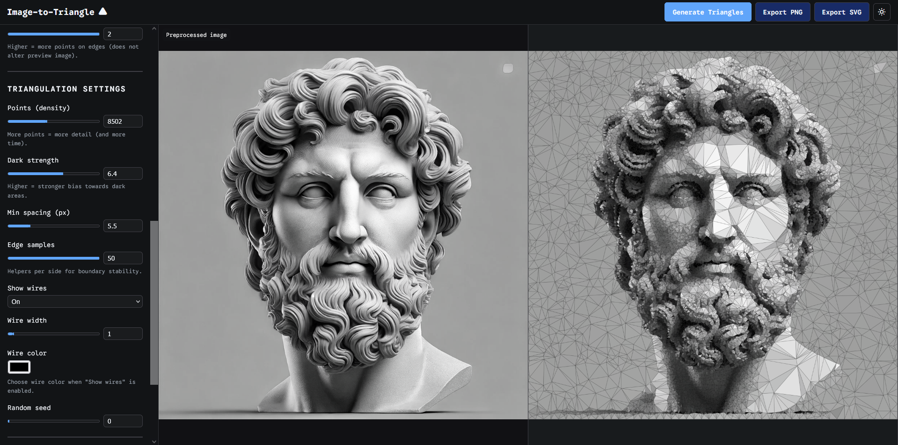
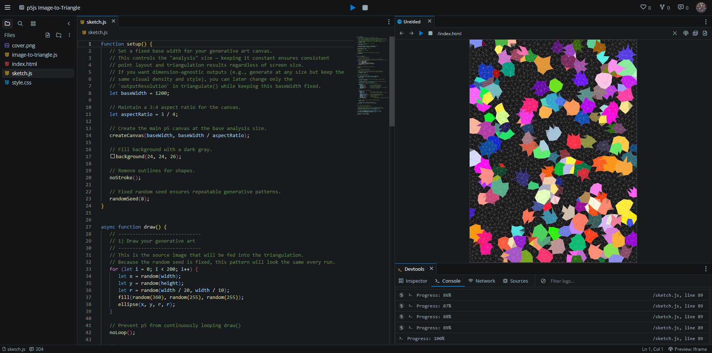

# Image-to-Triangle



Transform any image into beautiful low-poly triangular art with a single line of code. **No dependencies, no build steps** — just add one `<script>` tag and you're ready to go.

## 🎯 [Try the Live App](https://tezumie.github.io/Image-to-triangle/)

**Interactive image triangulator** — Drag & drop images, adjust settings in real-time, and export as PNG or SVG.

---

## ✨ Features

- 🖼️ **Hosted Web App** — Interactive UI with live preview and export
- ⚡ **Simple API** — One function call: `ImageToTriangle.triangulate()`
- 🎨 **Advanced Controls** — Brightness, contrast, edge detection, point density, and more
- 📐 **Resolution Separation** — Analyze at low resolution, render at any size
- 🎲 **Deterministic** — Same seed = same result every time
- 🔄 **Async & Progressive** — Built-in progress callbacks for smooth UX
- 📦 **Zero Dependencies** — Pure JavaScript, works everywhere

---

## 🚀 Quick Start

### CDN (Recommended)

```html
<script src="https://cdn.jsdelivr.net/gh/Tezumie/Image-to-triangle/src/image-to-triangle.js"></script>
```

### Basic Usage

```javascript
// Works with  or <canvas>
const result = await ImageToTriangle.triangulate({
  image: yourImageOrCanvas,
  points: 2000,
  format: 'canvas' // or 'image' or 'svg'
});

document.body.appendChild(result);
```

---

## 🎨 Examples

### Vanilla JavaScript

```html
<!DOCTYPE html>
<html>
<head>
  <script src="https://cdn.jsdelivr.net/gh/Tezumie/Image-to-triangle/src/image-to-triangle.js"></script>
</head>
<body>
  
  <div id="output"></div>

  <script>
    document.getElementById('source').onload = async () => {
      const result = await ImageToTriangle.triangulate({
        image: document.getElementById('source'),
        resolution: 800,           // Analysis size (keeps layout consistent)
        outputResolution: 1600,    // Render size (for crisp output)
        points: 3000,
        preprocess: {
          brightness: 1.2,         // Brighten the image
          contrast: 1.1,           // Boost contrast
          edgeBoost: 0.6           // Enhance edge detection
        },
        settings: {
          darkStrength: 4.0,       // Bias toward darker areas
          showWires: true,
          wireColor: '#ffffff',
          seed: 42                 // Reproducible results
        },
        onProgress: (percent) => console.log(`${percent}% complete`)
      });
      
      document.getElementById('output').appendChild(result);
    };
  </script>
</body>
</html>
```

### p5.js Integration

```javascript
let triangulated;

async function setup() {
  createCanvas(800, 600);
  
  // Your drawing code here...
  background(50);
  for (let i = 0; i < 100; i++) {
    fill(random(255), random(255), random(255));
    circle(random(width), random(height), random(20, 80));
  }
  
  // Triangulate the canvas (dimension-agnostic approach)
  triangulated = await ImageToTriangle.triangulate({
    image: canvas,
    resolution: 1200,          // Fixed analysis size
    outputResolution: width,   // Match current canvas size
    points: 2500,
    settings: {
      minDist: 1200 / 70,      // Scale settings to analysis resolution
      edgeSamples: 1200 / 10,
      wireWidth: 1200 / 500
    },
    format: 'canvas'
  });
  
  redraw();
}

function draw() {
  if (triangulated) {
    // Convert to p5.Image and display
    let img = createImage(triangulated.width, triangulated.height);
    img.drawingContext.drawImage(triangulated, 0, 0);
    image(img, 0, 0);
  }
}
```

---

## ⚙️ API Reference

### `ImageToTriangle.triangulate(options)`

```javascript
const result = await ImageToTriangle.triangulate({
  // Required
  image: HTMLCanvasElement | HTMLImageElement,
  
  // Resolution control (key feature!)
  resolution: 800,           // Analysis width - triangulation happens here
  outputResolution: 1600,    // Final render width - scales triangles up/down
  
  // Image preprocessing
  preprocess: {
    brightness: 1.0,         // 0.1 - 3.0
    contrast: 1.0,           // 0.1 - 3.0  
    saturation: 1.0,         // 0.0 - 2.0
    gamma: 1.0,              // 0.1 - 3.0
    blur: 0,                 // 0 - 10 pixels
    invert: false,
    densityMode: 'luma',     // 'luma' | 'lumaBoost' | 'red' | 'green' | 'blue'
    edgeBoost: 0.5          // 0.0 - 2.0 (enhances edge detection)
  },
  
  // Triangulation settings  
  settings: {
    points: 2000,            // Number of points to place
    darkStrength: 4.0,       // Bias toward dark areas (0.1 - 8.0)
    minDist: 8,              // Minimum point spacing
    edgeSamples: 20,         // Border enhancement points
    showWires: true,         // Show triangle edges
    wireColor: '#ffffff',    // Edge color (hex)
    wireWidth: 1.0,          // Edge thickness
    seed: 1,                 // Random seed for reproducible results
    settingsSpace: 'analysis' // 'analysis' | 'output' - which space to interpret sizes
  },
  
  // Output options
  format: 'canvas',          // 'canvas' | 'image' | 'svg'
  onProgress: (percent) => console.log(`${percent}% complete`)
});
```

### Key Concepts

- **`resolution`** — Controls where triangulation happens. Keep constant for consistent layouts across different output sizes
- **`outputResolution`** — Controls final render size. Scale this up for high-quality exports without changing triangle placement
- **`settingsSpace`** — Whether size params (`minDist`, `wireWidth`, etc.) are in analysis or output units
- **`darkStrength`** — Higher values (2-6) place more points in darker image areas for better detail
- **`edgeBoost`** — Enhances edge detection using Sobel filters for better triangle placement along boundaries
- **`densityMode`** — How to calculate point density: `'luma'` (brightness), `'lumaBoost'` (enhanced contrast), or individual color channels

---

## 🎯 Demos

**🖼️ Web App** — [Try the hosted app](https://tezumie.github.io/Image-to-triangle/)  
*Interactive image triangulator with drag & drop, real-time preview, and PNG/SVG export*

**💻 API Demo** — [Live code editor](https://codevre.com/editor?project=7kR8qQoxNCVu1AwDEoqetvzkVGC3_20250815193557929_rl39)  
*Dimension-agnostic p5.js integration showing the JavaScript API in action*

---

## 🖼️ Gallery



*Generated using p5.js with random circles and triangulation*

---

## 💡 Pro Tips

**For consistent layouts across sizes:**
```javascript
// Keep analysis resolution fixed, vary output size
const layout1 = await triangulate({ resolution: 1200, outputResolution: 800, ... });
const layout2 = await triangulate({ resolution: 1200, outputResolution: 2400, ... });
// Same triangle layout, different render sizes!
```

**For high-quality exports:**
```javascript
const result = await triangulate({
  resolution: 800,           // Fast analysis
  outputResolution: 3200,    // 4x render resolution
  format: 'svg'              // Vector output
});
```

---

## 📄 License

MIT © Tezumie

---

## 🛠️ Built With

This project was created using [Codevre](https://codevre.com) — a 100% free, browser-based code editor I built specifically for creative coders.  
It’s designed to make experimenting with interactive visuals, generative art, and web-based sketches fast and accessible, without setup or installation.  

If you enjoy working with projects like this, give Codevre a try!


---

⭐ **Star this repo if it helped you create something awesome!**
